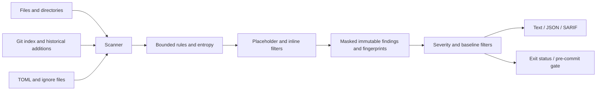

# LeakGuard

Developers accidentally push secrets to public repositories every day, and attackers' bots exploit them within minutes. LeakGuard catches them before they leave the developer's machine.

LeakGuard is a local, redaction-first secret scanner for Python 3.11+. Runtime code uses only the Python standard library. Git integration requires the Git CLI. There are no network calls, live credential checks, or uploads in the scanner.

## Features

- Eleven built-in detectors covering cloud keys, service tokens, private-key markers, password assignments, database URLs, and high-entropy strings.
- File/directory scanning, staged **index blob** scanning, and historical **added-line** scanning.
- Text, JSON, and GitHub-compatible SARIF 2.1.0 reports, with fully masked matches.
- Configurable rule selection, bounded custom patterns, size limits, ignore globs, inline suppressions, and digest-only baselines.
- A pre-commit hook that blocks findings and scanner failures, plus an isolated, disposable demonstration.
- Unit, property, Git integration, subprocess, golden, SARIF contract, fuzz, performance, and regression tests.

## Installation

From this repository:

```sh
python -m venv .venv
# Linux/macOS/Git Bash:
source .venv/bin/activate
# Windows PowerShell instead:
# .venv\Scripts\Activate.ps1
python -m pip install -e ".[dev]"
leakguard --version
```

For runtime use alone, `python -m pip install .` installs no third-party runtime dependencies. You can also run `python -I -m leakguard` after installation. The `-I` option prevents importing similarly named modules from the scanned directory.

## Quick start and actual sample output

Create a synthetic example at runtime, so the repository never stores a complete service token:

```sh
python -c 'from pathlib import Path; Path("sample.env").write_text("AKIA" + "B2C3D4E5F6G7H8J9" + "\n")'
leakguard scan sample.env --no-color
```

The following text and JSON were captured by running the implemented CLI against that example. Both commands return exit code 1:

```text
HIGH "sample.env":1:1 aws-access-key ********************
```

```sh
leakguard scan sample.env --format json
```

```json
{
  "version": "0.1.0",
  "findings": [
    {
      "rule_id": "aws-access-key",
      "severity": "HIGH",
      "file": "sample.env",
      "line": 1,
      "column": 1,
      "redacted_snippet": "********************",
      "fingerprint": "1e4549cd52e8a356d1cad58b428aff0b4f7c72b636c62e970a824b6a43a70819",
      "commit": null,
      "author": null
    }
  ]
}
```

Common commands:

```sh
leakguard scan                         # current directory
leakguard scan src/ settings.env --min-severity HIGH
leakguard scan --staged
leakguard scan --config .leakguard.toml --max-file-size 2097152
leakguard scan --baseline reviewed.json --format sarif > findings.sarif
leakguard scan-history                 # all commits reachable from all refs
leakguard scan-history --since main~5   # exclusive revision through HEAD
leakguard rules
leakguard hook install
leakguard hook uninstall
```

Exit codes: **0** = no unsuppressed findings at the requested severity; **1** = findings; **2** = argument/configuration/runtime error or interruption. Diagnostics go to stderr without source contents or raw tracebacks. Color is used only for text output on a TTY unless `--no-color` is set. Quoted paths are supported; use `--` before a positional path that starts with a dash.

## Detection rules

| ID | Severity | Description |
| --- | --- | --- |
| `aws-access-key` | HIGH | AKIA/ASIA prefix followed by sixteen uppercase letters/digits |
| `aws-secret-key` | CRITICAL | Forty-character base64-like value in an AWS/secret-access-key assignment |
| `github-token` | CRITICAL | ghp, gho, ghs, and github_pat token families |
| `slack-token` | HIGH | xoxb, xoxp, and xapp token families |
| `stripe-key` | CRITICAL | sk_live and rk_live keys |
| `google-api-key` | HIGH | Google API key prefix and thirty-five-character suffix |
| `jwt` | HIGH | Three bounded base64url segments with an eyJ header prefix |
| `private-key` | CRITICAL | PEM private-key BEGIN markers, including RSA, EC, OpenSSH, and PGP |
| `generic-secret` | MEDIUM | Password/passwd/secret/token/api_key/apikey assignments |
| `database-url` | HIGH | Credential-bearing PostgreSQL, MySQL, MongoDB, or Redis URLs |
| `high-entropy` | LOW | High-entropy base64/hex-like candidates |

Private-key detection reports the BEGIN marker without retaining or printing the key body. Generic values must be at least eight characters; the detector accepts quoted values and unquoted `.env`-style values. Known placeholders, repeated characters, environment lookups, and Python call/indexing expressions are filtered. Signature rules identify suspicious shapes, not credential validity.

## Entropy

Shannon entropy is `H = -sum(p_i * log2(p_i))`, measured in bits per character. Empty or repeated-character strings score zero. Base64-like candidates of 20–256 characters use a default threshold of **4.5** bits/character. Hex candidates use 75% of that threshold (**3.375** by default) because hex has at most four bits/character, versus roughly six for base64.

Candidates must contain both letters and digits, reducing ordinary prose matches. Candidates overlapping a recognized rule match do not produce a duplicate entropy finding. Entropy is intentionally LOW severity: digests, random IDs, and generated assets can also look secret. Use targeted ignores or a reviewed baseline for those cases.

## Configuration and suppression

An optional `.leakguard.toml` is loaded from the current directory, or from the repository root for staged/history scans. Explicit `--config` paths must exist. Unknown keys, invalid types, unsupported IDs, and unsafe custom patterns fail closed.

```toml
disabled_rules = ["jwt"]
entropy_threshold = 4.8
ignore_paths = ["vendor/", "*.min.js"]
max_file_size = 1048576

[[custom_rules]]
id = "company-key"
description = "Internal key prefix"
pattern = "ACME_[A-Z0-9]{20}"
severity = "HIGH"
```

Custom patterns intentionally support a narrow regex subset: literal characters and character classes, with at most one bounded repetition of 1–256 characters. Groups, alternation, backreferences, lookarounds, and unbounded quantifiers are rejected. The entire custom match is masked. This trades flexibility for predictable matching time.

`.leakguardignore` supports POSIX globs, basename patterns such as `*.log`, and directory patterns ending in `/`. It is **not** a complete `.gitignore` implementation: there is no negation or escape syntax. Git's own ignore file is not automatically honored, so local untracked `.env` files can still be scanned.

Suppress a reviewed line with a comment:

```text
# Append: leakguard:ignore
# Or append: leakguard:ignore=aws-access-key
```

Actual suppressions require a comment marker (`#`, `//`, `;`, or `<!--`) followed by the directive. A named directive suppresses only that rule; independent detections, including entropy, can still appear. This is a textual convention, not a programming-language parser. Prefer removing and rotating a real credential over suppressing it.

## Baselines and hooks

```sh
leakguard baseline create . --output .leakguard-baseline.json
leakguard scan --baseline .leakguard-baseline.json
leakguard hook install
```

The default `.leakguard-baseline.json` is automatically loaded by scans when present. It is excluded from scanning. A baseline contains only a schema version and sorted SHA-256 fingerprints; replacement is atomic. Baseline creation deliberately scans current findings without applying an existing baseline. Review baseline changes as policy changes.

Fingerprints hash a serialized tuple of rule ID, normalized relative path, a SHA-256 value hash, and whitespace-normalized source line. Source content is never serialized to a baseline. Line numbers and commit IDs are excluded, so adding unrelated lines preserves a match's fingerprint. Moving a file, editing its surrounding line, or changing its value invalidates the fingerprint; identical repeated lines in one file share it. Digests are not encryption and low-entropy values may be susceptible to guessing if enough context is known.

The hook reads complete added/modified **staged blobs**, not working-tree files. This catches a staged secret even when the disk copy has been cleaned. Deletions and nonregular blobs are skipped. Hook errors also block the commit. The generated script runs the installation's absolute Python interpreter in isolated mode (`-I`), protecting against a repository-local `leakguard.py` shadowing the package.

Installation honors Git's `core.hooksPath` and linked worktrees. Existing foreign hooks require explicit `--force`; symlinked hooks are refused. Uninstall removes only recognized LeakGuard hook templates. Keep the installing environment available, or reinstall the hook after moving it. Hooks are local convenience controls and can be bypassed by Git users; CI scanning provides a separate check.

## Architecture



```text
src/leakguard/
  models.py      immutable Finding and Severity; masking/fingerprints
  errors.py      clean domain exceptions
  rules.py       detector definitions and validators
  entropy.py     pure entropy calculations and bounded candidates
  scanner.py     text/bytes/file/directory scanning
  config.py      strict TOML and safe custom-pattern validation
  ignore.py      glob and inline suppression
  baseline.py    digest-only persistence
  gitutils.py    Git index, revision ranges, history patches
  reporters.py   text, JSON and SARIF 2.1.0
  hook.py        owned hook lifecycle
  cli.py         argument parsing, orchestration, exit codes
  __main__.py    python -m leakguard
tests/           unit, integration, property, contract and robustness suites
tests/golden/    committed templates and redacted expected outputs
examples/demo.sh disposable repository demonstration
```

## Design decisions and limitations

- Runtime dependencies are standard-library-only; build tooling and development tools are separate. Tests require Git. Bash is needed for the demonstration and Make targets need Make; equivalent Python commands work without Make.
- Default maximum file size is 1 MiB. Oversized files, NUL-containing files, `.git`, `node_modules`, virtual-environment directories, and directory symlinks are skipped. File symlinks escaping the root are skipped. Invalid UTF-8 is decoded with replacement to preserve ASCII credential detection. Unicode columns are character offsets, not byte offsets.
- Worktree traversal uses bounded reads. Git history processes each commit/path separately and checks blob size before reading; Git's captured metadata/diff output is not a fully streaming protocol. Git calls time out after 30 seconds. Large histories can be slow.
- History uses `git log -p` and scans additions, preserving original new-file line numbers, author names, and commit IDs. `--since REV` means `REV..HEAD`, exclusive. Without it, all reachable refs are searched; reflog-only and unreachable commits are outside scope. Merge additions are relative to the first parent. Binary historical blobs are skipped even if attributes force a text diff.
- Baselines/ignore/configuration are local policy files, including when the hook runs. Protect changes to these files in code review; the hook is not a tamper-resistant policy sandbox.
- Values are **fully** masked, rather than revealing prefix/suffix characters. Snippets cap at 80 mask characters; the standalone redaction function preserves input length. Source lines and private-key bodies never enter reports. Normal file paths and commit author metadata remain visible.
- No scanned source is executed or imported. Git external diff and text-conversion helpers are disabled. The filesystem checks do not claim protection against concurrent hostile symlink replacement or supply a forensic snapshot.
- Generic detection and placeholder filtering are heuristic. Custom regex restrictions, token length bounds, splitting secrets over multiple lines, unusual encodings, and secrets without recognizable context can produce misses. High entropy can produce false positives. No claim is made that a clean report proves absence of secrets.
- Compared with tools such as gitleaks or TruffleHog, this is a deliberately small local scanner, with no live secret verification, provider API integration, encoded-secret decoding, or comprehensive provider catalog.
- This repository excludes golden expected reports and README from entropy self-scanning because they contain generated fingerprint digests. Source and tests remain scanned; build/test artifacts are ignored. Complete fake service tokens are assembled at runtime by `tests/fakes.py`, never committed to fixtures. Golden templates expand only in temporary directories.
- Ruff enables E, F, I, B, UP, and S. E501 is disabled because the formatter handles readability. Test-only S exemptions permit assertions, synthetic credentials, and real temporary Git subprocesses. Git subprocess S603/S607 exemptions are scoped to the argument-array Git wrapper. There are no broad production security-rule exemptions.

## Tests and development

```sh
ruff check .
pytest
pytest --cov=leakguard --cov-report=term-missing --cov-fail-under=90
pytest --update-golden tests/test_golden.py
pytest -m perf
bash examples/demo.sh
# Linux/WSL only:
mutmut run --max-children 2
mutmut results --all true
```

Golden comparisons are exact and use relative paths and deterministic metadata. To update the package version, intentionally regenerate and review snapshots. Hypothesis uses a derandomized `ci` profile with bounded examples and no timing deadline; separate performance tests use generous time bounds. Tests create temporary repositories, set local identity, disable global/system Git configuration, and never modify the caller's repository or home directory.

Make targets: `test`, `cov`, `mutate`, `lint`, `demo`, and `all` (lint, coverage, demo). On Windows, run the demo in Git Bash or start its login shell so `mktemp` and the other POSIX tools are available. The `PYTHON` environment variable may select the installed interpreter.

## Quality metrics

Measured locally with Python 3.12.14 on Windows; these are executed results, not targets:

| Check | Result |
| --- | --- |
| Test suite | 157 passed |
| Statement + branch coverage | 99.73% overall; required gate 90% |
| Ruff | Clean |
| Disposable Bash demo | Completed with exit code 0 |
| Dogfooding | Clean, exit code 0 |
| Mutation score | **Not measured: native Windows unsupported** |
| Accepted surviving mutants | None assessed; no mutation run completed |

`mutmut run` was actually attempted with mutmut 3.8.0 and exited with:

```text
To run mutmut on Windows, please use the WSL. Native windows support is tracked in issue https://github.com/boxed/mutmut/issues/397
```

No mutation percentage or survivor count is claimed. The manually triggered Linux `mutation` job targets `rules.py` and `entropy.py`, preserves the complete package for imports, and uploads detailed mutation results for review. The requested 80% mutation target remains **unverified** until that job runs. Linux CI and the Python 3.11 matrix are configured but have not been run in this local Windows session.

Local coverage report:

```text
Name                         Stmts   Miss Branch BrPart  Cover
src/leakguard/__init__.py        1      0      0      0   100%
src/leakguard/__main__.py        2      0      0      0   100%
src/leakguard/baseline.py       31      0      8      0   100%
src/leakguard/cli.py           116      0     36      0   100%
src/leakguard/config.py         85      0     34      0   100%
src/leakguard/entropy.py        20      0      8      0   100%
src/leakguard/errors.py          4      0      0      0   100%
src/leakguard/gitutils.py       86      1     40      1    98%
src/leakguard/hook.py           41      0     10      0   100%
src/leakguard/ignore.py         33      0     10      0   100%
src/leakguard/models.py         26      0      0      0   100%
src/leakguard/reporters.py      28      0      6      0   100%
src/leakguard/rules.py          25      0      0      0   100%
src/leakguard/scanner.py        68      0     32      0   100%
TOTAL                          566      1    184      1    99%
Required test coverage of 90% reached. Total coverage: 99.73%
```

## CI and SARIF

The included workflow tests Python 3.11/3.12, enforces lint and 90% coverage, runs the demo, and dogfoods the scanner. SARIF upload requires GitHub code scanning to be available for the repository and permission to write security events. Fork pull requests skip the upload permission boundary.

Minimal integration:

```yaml
permissions:
  contents: read
  security-events: write
steps:
  - uses: actions/checkout@v4
  - uses: actions/setup-python@v5
    with:
      python-version: '3.12'
  - run: python -m pip install .
  - run: leakguard scan . --format sarif > leakguard.sarif
  - uses: github/codeql-action/upload-sarif@v3
    if: always()
    with:
      sarif_file: leakguard.sarif
```

## Responsible use

Scan only repositories and files you are authorized to inspect. Treat reports and baselines as sensitive metadata. When a real credential is found, revoke or rotate it; removing the current file does not remove Git history or invalidate the credential. Do not use synthetic examples as real credentials.

## AI-assisted development

This project was built with assistance from an AI coding assistant. Automated tests and recorded tool runs support the quality claims; they do not replace security review.

## Publish

The local repository uses branch `main` and conventional commits. No remote is configured and nothing has been pushed. With GitHub CLI installed and authenticated, create a repository, then attach and push:

```sh
gh repo create leakguard --private
git remote add origin <URL> && git push -u origin main
```

Replace `<URL>` with the created repository's clone URL. Choose `--public` instead of `--private` only when ready to publish publicly.
